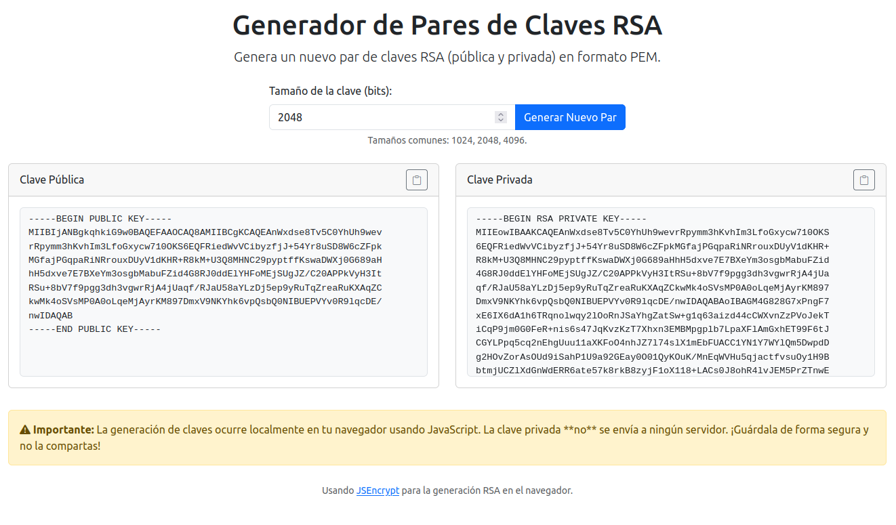

# Generador Local (HTML/JS) de Pares de Claves RSA 🔑

[](https://opensource.org/licenses/MIT)
[](https://soyunomas.github.io/local-rsa-generator-html-js/)
[](https://developer.mozilla.org/en-US/docs/Web/JavaScript)
[](https://html.spec.whatwg.org/multipage/)
[-blue?icon=laptop)](./#como-funciona-proceso-100-local--en-el-navegador-%EF%B8%8F)

Una aplicación web **auto-contenida (HTML/JS)**, sencilla y segura para generar pares de claves criptográficas RSA (pública y privada) **directamente en tu navegador**. 🛡️ ¡Tu clave privada nunca sale de tu ordenador!


*Referencia: screenshot.png en el repositorio.*

## 🚀 Demo en Vivo

Puedes probar la aplicación directamente en tu navegador aquí:
**[https://soyunomas.github.io/local-rsa-generator-html-js/](https://soyunomas.github.io/local-rsa-generator-html-js/)**

*(La demo se sirve directamente desde GitHub Pages usando el archivo `index.html` de este repositorio)*

## ✨ Características Principales

*   **Generación 100% Local (HTML/JS):** Todo el proceso ocurre en tu navegador. ¡Máxima privacidad! 💻
*   **Tamaño de Clave Configurable:** Elige entre 1024, 2048, 4096 bits (o introduce otro múltiplo de 8).
*   **Formato PEM Estándar:** Las claves se generan en el formato PEM universalmente compatible.
*   **Copia Fácil:** Botones dedicados (📋) para copiar cada clave al portapapeles con un solo clic.
*   **Interfaz Limpia:** Diseño intuitivo y responsivo gracias a Bootstrap.
*   **Sin Dependencias Externas (Software):** No necesitas instalar nada, solo tu navegador web y el archivo `index.html`.

## 💻 ¿Cómo Funciona? (Proceso 100% Local / En el Navegador 🛡️)

Esta herramienta es un único archivo `index.html` que utiliza HTML para la estructura, Bootstrap CSS para el estilo y JavaScript (incluyendo la librería [JSEncrypt](https://github.com/travist/jsencrypt)) para realizar todos los cálculos criptográficos **dentro de tu navegador web**.

**Punto Clave:** En ningún momento se envían tus claves (especialmente la privada) a ningún servidor externo. La generación es segura y privada, ocurriendo únicamente en tu máquina local, dentro del entorno aislado de tu navegador.

## 🛠️ Tecnologías Utilizadas

*   **HTML5:** Estructura de la página (archivo único `index.html`).
*   **CSS3 (Embebido + Bootstrap):** Estilos básicos y personalizados.
*   **Bootstrap (v5.3):** Framework CSS para el diseño y componentes (cargado vía CDN).
*   **Bootstrap Icons:** Iconos utilizados en la interfaz (cargado vía CDN).
*   **JavaScript (ES6+, Embebido):** Lógica de la aplicación, interacción y manejo de la librería criptográfica.
*   **[JSEncrypt](https://github.com/travist/jsencrypt):** Librería para la generación de claves RSA en el cliente (cargado vía CDN).

## ⚙️ Instalación / Visualización Local

Si prefieres ejecutarlo desde una copia local (recomendado para mayor privacidad si no confías en CDNs a largo plazo, aunque para este caso de uso es generalmente seguro):

1.  **Clona el repositorio:**
    ```bash
    git clone https://github.com/soyunomas/local-rsa-generator-html-js.git
    ```
2.  **Navega al directorio:**
    ```bash
    cd local-rsa-generator-html-js
    ```
3.  **Abre el archivo `index.html` en tu navegador web preferido.**

    *Nota Importante:* La página carga las librerías externas (Bootstrap, JSEncrypt) desde una CDN. Por lo tanto, **necesitarás conexión a internet la primera vez** que la abras para que estas librerías se descarguen. Después, podrían funcionar offline si tu navegador las guarda en caché. Si deseas uso 100% offline, tendrías que descargar estas librerías y referenciarlas localmente en el `index.html`.

## ▶️ Uso

1.  Abre `index.html` en tu navegador (o visita la [demo online](https://soyunomas.github.io/local-rsa-generator-html-js/)).
2.  Selecciona el **tamaño de bits** deseado para la clave RSA.
3.  Haz clic en el botón **"Generar Nuevo Par"**.
4.  Espera unos segundos (especialmente para claves grandes).
5.  Las claves **pública** y **privada** aparecerán en sus respectivas cajas en formato PEM.
6.  Usa los botones de copia (📋) para copiar la clave que necesites.

## ⚠️ Nota Importante de Seguridad

Aunque la generación es **completamente local** en tu navegador:
*   La seguridad general depende también de la seguridad de tu propio sistema y navegador (extensiones maliciosas, etc.).
*   Para claves de **misión crítica** o de muy alta seguridad, la práctica recomendada suele ser generarlas en un entorno offline seguro utilizando herramientas dedicadas (como OpenSSL en un sistema air-gapped).
*   **¡GUARDA TU CLAVE PRIVADA DE FORMA SEGURA Y NUNCA LA COMPARTAS!** Es la llave maestra a tus datos o accesos.

## 📄 Licencia

Este proyecto está bajo la **Licencia MIT**. Consulta la insignia al principio de este README o visita [https://opensource.org/licenses/MIT](https://opensource.org/licenses/MIT) para ver el texto completo de la licencia.

## 👤 Contacto

Creado por **[soyunomas](https://github.com/soyunomas)**.

¡Recuerda usar este nuevo nombre (`local-rsa-generator-html-js`) cuando crees el repositorio en GitHub!
